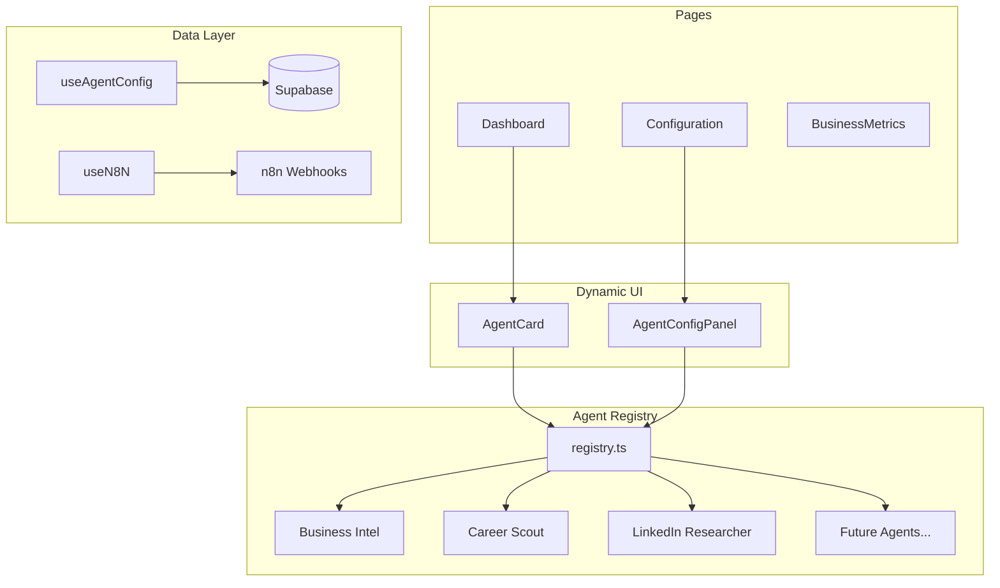

# Mission Control - Architecture

Extensible React frontend for Agentic AI Chief of Staff. Manages three domains: **Business Intelligence**, **Career Portfolio**, and **Lifestyle Logistics**.

## Tech Stack

| Layer | Technology |
|-------|------------|
| Framework | React 19 + Vite + TypeScript |
| Styling | Tailwind CSS v4 + shadcn/ui |
| State | React Query |
| Backend | Supabase (data) + n8n (workflows) |
| Icons | Lucide React |
| Charts | Recharts |
| Toasts | Sonner |

## Design Principle: Agent Registry

To easily add new agents, we use a **registry pattern**. Each agent is defined declaratively and the UI renders dynamically.

```typescript
// Add new agents to registry.ts - no component changes needed
const AGENTS: AgentDefinition[] = [
  { id: 'business-intel', name: 'Business Monitor', category: 'business', ... },
  { id: 'career-scout', name: 'Career Portfolio Scout', category: 'career', ... },
  { id: 'linkedin-researcher', name: 'LinkedIn Researcher', category: 'career', ... },
  // Future: { id: 'travel-planner', name: 'Travel Planner', category: 'lifestyle', ... }
];
```

## Agent Domains

### Business Intelligence (Thai Tone Trainer)

| Config | Type | Description |
|--------|------|-------------|
| Briefing Time | Time | Daily kickoff (default 09:00 CET) |
| Anomaly Threshold | % | Traffic spike/drop trigger |
| Budget Limit | € | Monthly spend cap |
| Alert at | % | Warning threshold (90%) |

### Career Portfolio Scout (EMEA)

| Config | Type | Description |
|--------|------|-------------|
| Regions | Multi-select | Include: EMEA, Exclude: US/AU |
| Bangkok | Toggle | Observatory mode (save only) |
| Language Priority | Slider | English vs German weight |
| Engagement Types | Checkboxes | Full/Part/Contract/Fractional |
| Auto-Apply | Toggle | Easy Apply for Tier-1 matches |

### LinkedIn Researcher

| Config | Type | Description |
|--------|------|-------------|
| Topics | Tags | Frontier AI, RAG, Agentic AI, etc. |
| Personas | Multi-select | EU Regulation, Mittelstand, CTO |
| Output Format | Select | Review Deck, LinkedIn Posts |

## Bremen Protocol (Shared Settings)

| Setting | Type | Description |
|---------|------|-------------|
| Deep Work Block | Time Range | 09:00-12:00 (no interrupts) |
| High-Status Whitelist | Domain List | Bypasses Deep Work silence |
| Mobility Mode | Enum | E-bike / Transit / Auto |
| Weather Override | Toggle | Rain triggers transit-only |
| Toddler Buffer | Minutes | Added to transit calculations |

## Architecture Diagram



## Component Tree

```
src/
├── agents/                    # Agent registry
│   ├── registry.ts           # Central agent definitions
│   ├── business-intel.ts     # Business agent config
│   ├── career-scout.ts       # Career agent config
│   ├── linkedin-researcher.ts
│   └── shared/
│       └── bremen-protocol.ts # Shared settings
├── components/
│   ├── agents/               # Agent-specific UI
│   │   ├── AgentCard.tsx     # Generic (renders any agent)
│   │   └── AgentConfigPanel.tsx
│   ├── shared/
│   │   ├── Layout.tsx
│   │   ├── Header.tsx
│   │   └── OfflineIndicator.tsx
│   └── ui/                   # shadcn/ui
├── hooks/
│   ├── useAgentConfig.ts
│   ├── useAgentLogs.ts
│   └── useN8N.ts
├── pages/
│   ├── Dashboard.tsx
│   ├── Configuration.tsx
│   └── BusinessMetrics.tsx
└── types/
    ├── agent.ts              # AgentDefinition, ConfigField
    └── database.ts           # Supabase types
```

## Database Schema

### agent_configs

```sql
key: string        -- e.g., "career-scout.geofence"
value: jsonb       -- e.g., { "include": ["EMEA"], "exclude": ["US","AU"] }
last_updated: timestamp
```

### agent_logs

```sql
id: uuid
agent_name: string -- Maps to AgentDefinition.id
action_detail: text
status: 'success' | 'error' | 'pending'
created_at: timestamp
```

### business_metrics

```sql
date: date
users: int
revenue: float
spend: float
```

## Environment Variables

```env
VITE_SUPABASE_URL=your-supabase-url
VITE_SUPABASE_ANON_KEY=your-anon-key

# Agent webhooks (extensible)
VITE_N8N_BUSINESS_INTEL_URL=placeholder
VITE_N8N_CAREER_SCOUT_URL=placeholder
VITE_N8N_LINKEDIN_RESEARCHER_URL=placeholder
```

## Adding a New Agent

1. Create `src/agents/new-agent.ts` with config fields
2. Add entry to `registry.ts`
3. Add webhook env var to `.env`
4. Create Supabase table if unique data needed

**No component changes required**—the UI renders from the registry.
